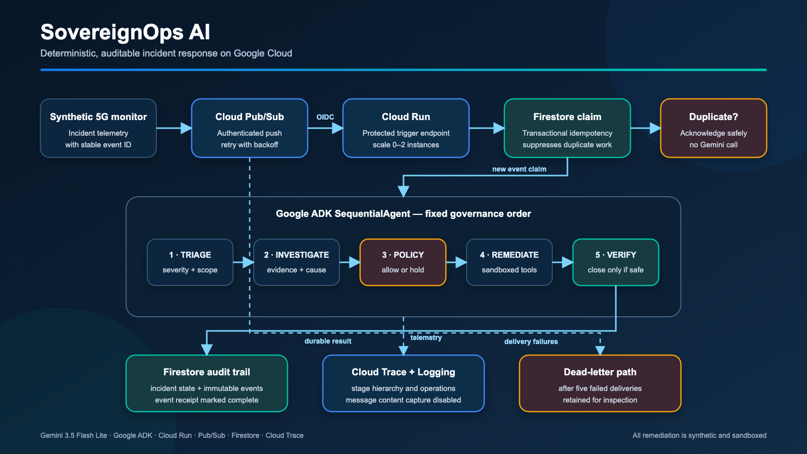
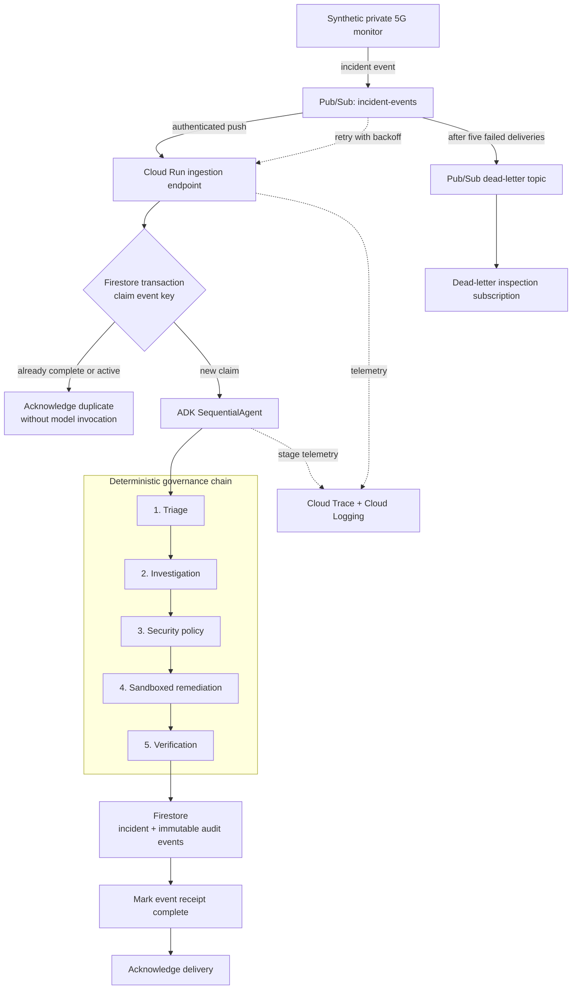

# Architecture and governance flow

The upload-ready PNG is 1600×900. The editable source is `architecture.svg`.

## Trust boundaries

- Cloud Run remains authenticated; Pub/Sub invokes it with a dedicated identity.
- Remediation tools mutate only a deterministic sandbox state.
- Policy evaluation always precedes remediation.
- Verification must succeed before the workflow records `RESOLVED`.
- Firestore receipts suppress repeat work under Pub/Sub's at-least-once delivery.
- Prompt and response content capture is disabled in telemetry.
